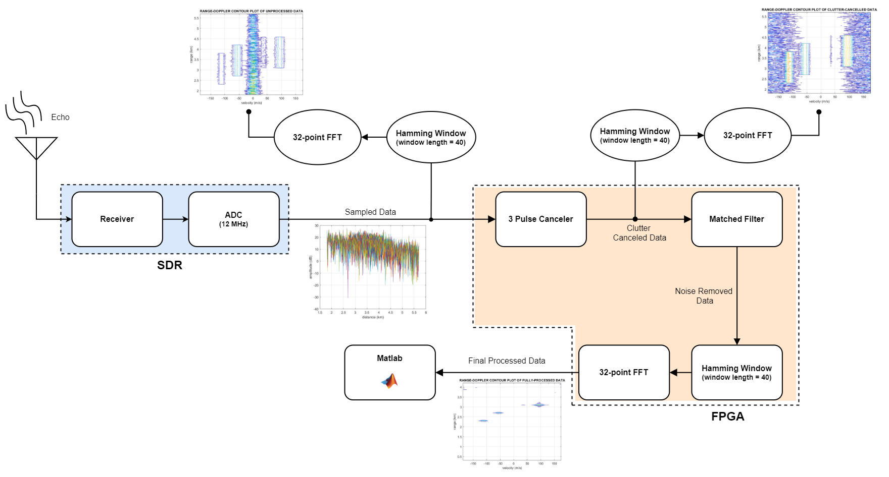
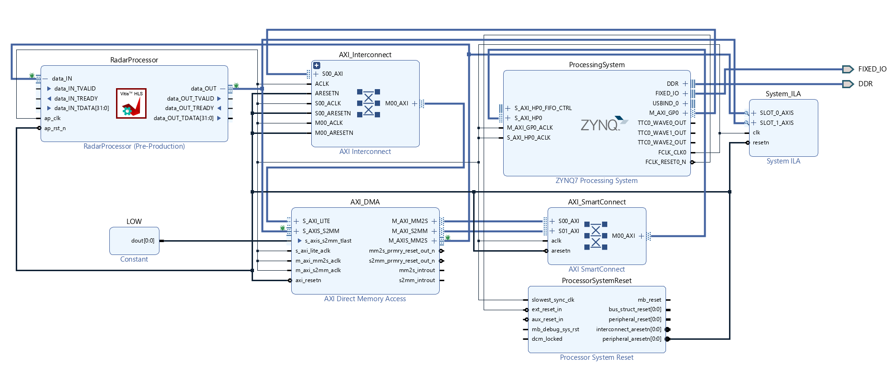

# FPGA Radar Signal Processor

## Introduction

FPGAs (Field-Programmable Gate Arrays) are used extensively for high-computing applications due to their flexibility, parallel processing capabilities, efficiency, and rapid prototyping. They excel in running digital signal processing (DSP) algorithms quickly. In the context of radar signal processing, FPGA implementations have significantly improved computation speed, accuracy, and precision compared to traditional methods.

This project focuses on implementing a radar signal processor on an FPGA board. The signal processing component is designed to generate RF pulses, perform chirp signal generation, and process received data. Prior to hardware implementation, the radar system is simulated in MATLAB to determine the required parameters.

## Signal Processing on FPGA

The signal processing part is designed to be implemented on an FPGA (ZC702) board. It is designed to produce pulses with monotonous frequency as well as chirp. The required RF pulse is generated at the baseband, which will be upconverted to X-band on the SDR (Software-Defined Radio) and transmitted.

The FPGA is programmed to store the sampled data coming from the SDR in the form of a data matrix. The data stored in the data matrix is used to extract the Doppler and range information. Before its implementation onto an actual FPGA board, the radar is simulated using MATLAB to find the best parameters required for the radar to operate.

## Implemented Algorithms

This project includes the implementation of various algorithms, including:

- Hamming window
- FFT (Fast Fourier Transform) algorithm
- Double delay-line canceler
- Matched filtering

### Double Delay-Line Canceler

The data matrix is multiplied by a coefficient matrix using the Xilinx Vitis tool. The data matrix has dimensions of 313 x 40, while the coefficient matrix is 40 x 39. This matrix multiplication results in a 313 x 39 output matrix. The algorithm is implemented in C++ and converted to Verilog for FPGA deployment.

### Matched Filtering

After clutter cancellation, matched filtering is applied to improve the signal-to-noise ratio. This involves convolution with a time-delayed chirp signal. The filter coefficients are generated in MATLAB and stored as an array. Convolution is performed on the data matrix along the fast time samples.

### Hamming Window

To reduce spectral leakage in the FFT, a Hamming window is applied. The Hamming window coefficients are generated in MATLAB and multiplied with the data in the data matrix along the slow time samples.

### Fast Fourier Transform (FFT)

A 32-point FFT is performed on the windowed data along the slow time samples. FFT results are obtained through matrix multiplication.

## Microprocessor

Our attention turns to the hardware configuration and programming of the processing system. The Zynq-7000 devices feature dual-core ARM Cortex-A9 processors, with the sole purpose of facilitating data transfer from the SD card to the FPGA module. Notably, in consideration of the substantial data involved, both stack and heap memory allocations in Vitis SDK were manually adjusted to around 100KB.
DMA (Direct Memory Access) is used for data transfer between the processing system and programmable logic. Vitis SDK is used to write C/C++ instructions for the processor. Data is read from and written to the SD card using the FatFs module. Interrupts are employed to manage data transfer between the processing system and programmable logic.

## Simulation and Verification

The MATLAB simulation of the radar model has been successfully completed, including the successful extraction of target parameters that match the actual target parameters. The entire radar signal processor has been implemented and its functionality validated by comparing it with a MATLAB reference.

